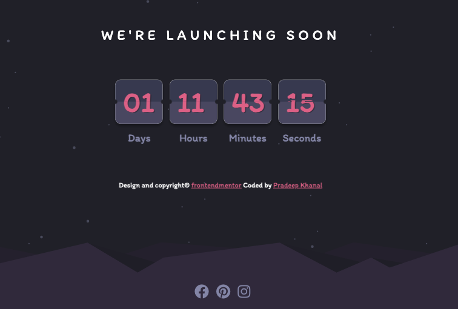

# Frontend Mentor Launch Countdown Timer

This repository contains the code for a launch countdown timer app, developed as a solution to the [Frontend Mentor Challenge](https://www.frontendmentor.io/challenges/launch-countdown-timer-N0XkGfyz-) challenge.However, the app displays a live time and date from the system in order to make it more customizable for the user to set their own lauch date in the future while using this app.

## Features

- Displays live date and time.
- Shows the time in days, hours, minutes, and seconds.
- Flips the cards in real-time using css which looks easy on the eyes yet a tricky animation to implement.
- Updates the countdown in real-time.
- Responsive design, suitable for various screen sizes.

## Technologies Used

- HTML
- CSS
- JavaScript

## Getting Started

To run the launch countdown timer app locally, follow these steps:

1. Clone the repository: `git clone https://github.com/pradeepkhanal23/live-time-and-date.git`
2. Navigate to the project directory: `cd live-time-and-date`
3. Open the `index.html` file in your web browser.

## Usage

1. Open the app in your browser.
2. Set the target date for the countdown by removing the `Date` object in the JavaScript code and manually adding a desired date.
3. The countdown timer will display the live time and date and also the time remaining until the specified date and time, updating in real-time.

## Customization

You can customize the appearance and behavior of the countdown timer by modifying the CSS and JavaScript code:

- Adjust the colors, fonts, and layout in the CSS file (`styles.css`) to match your preferred design.
- Modify the `flipCard` function in the JavaScript code (`script.js`) to set a different target date and time for the countdown.

## License

This project is licensed under the [MIT License](LICENSE).

## Acknowledgements

This app was developed as a solution to the [Frontend Mentor](https://www.frontendmentor.io) [launch countdown timer challenge](https://www.frontendmentor.io/challenges/launch-countdown-timer-N0XkGfyz-).

## Contact

If you have any questions or suggestions, feel free to reach out to the project maintainer:
